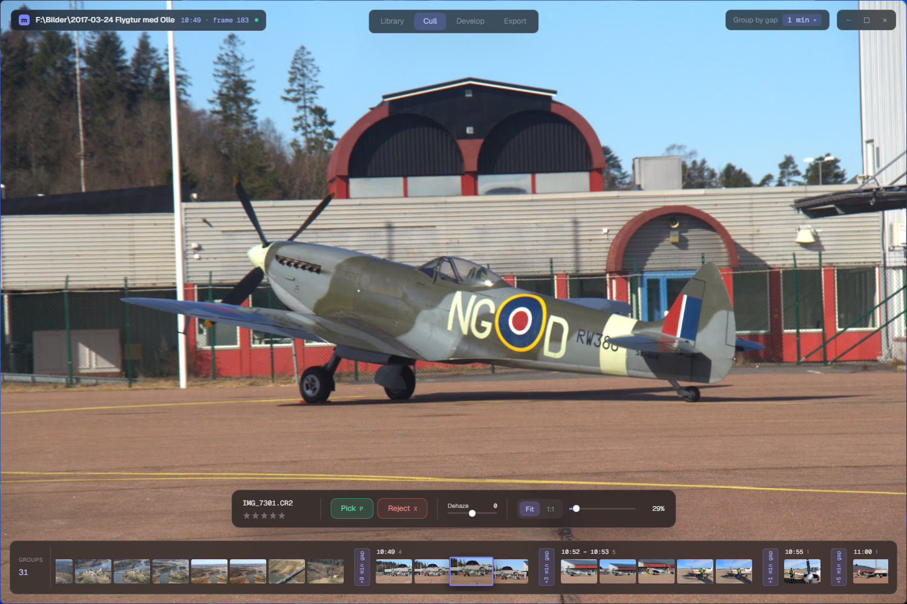
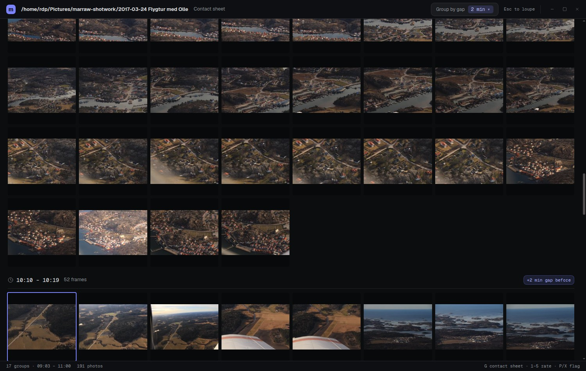
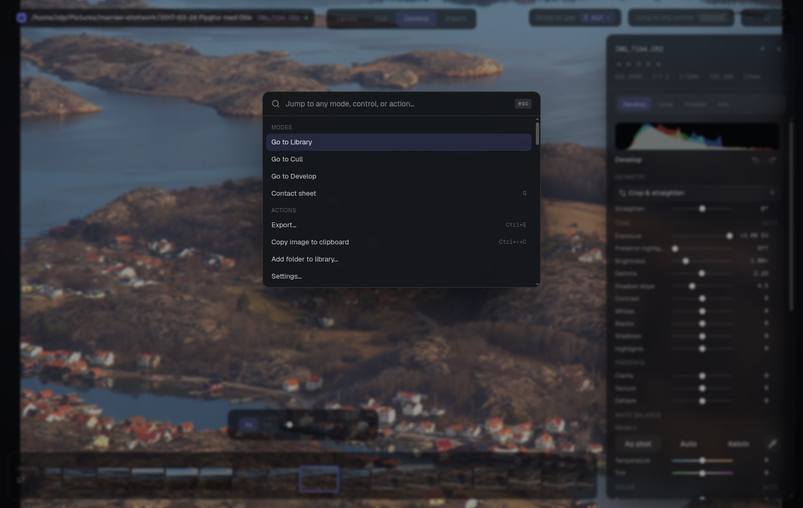
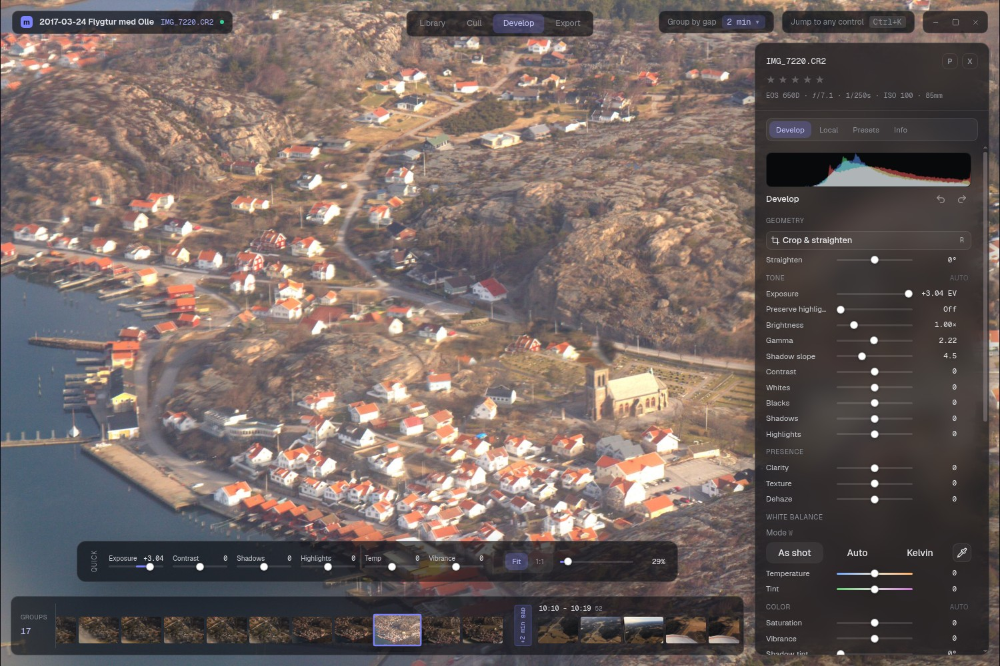

# marraw

Fast RAW photo culling and editing. Built for photographers who shoot a lot,
keep a little, and want the boring part to be over quickly.

marraw is a desktop app: a Go daemon that talks to LibRaw does the pixel work,
a React front-end does the rest, and Electron holds it together.

Cull mode. The scrubber deck has already broken 191 frames into 31 groups —
note the `+6 min gap`, `+3 min gap` dividers between runs.

> **Status: early. Windows only.**
> Version 0.1 is usable daily but the feature set is deliberately narrow — read
> [What marraw does *not* do](#what-marraw-does-not-do) before you invest time
> in it. Nothing is stopping a macOS/Linux build except work; see
> [DEVELOPER.md](DEVELOPER.md#porting-to-macos-and-linux).

---

## Install

Grab `marraw-Setup-<version>.exe` from the
[latest release](https://github.com/marrasen/marraw/releases/latest).

The installer is not code-signed yet, so Windows SmartScreen will warn you once
— **More info → Run anyway**. After that the app updates itself: it checks
GitHub on launch, downloads new versions in the background, and installs them
when you quit.

**Requirements:** Windows 10 or 11, 64-bit. No LibRaw DLLs, no runtime, no
Python. One installer.

---

## What makes it different

**It is fast, and it stays fast at 1:1.**
Grid thumbnails come straight from the RAW's embedded JPEG — no decode, so a
folder of 1,500 frames is browsable immediately. Every photo is cached as a
pyramid of JPEG renditions (256 → 2048 px). Zoom past 2048 and marraw switches
to full-resolution tiles, downloading and decoding only the crop you are
actually looking at, over an upscaled underlay, while the *next* photo's tiles
pre-render in the background. Comparing a burst at 100% doesn't stutter.

**It knows a shoot is made of bursts, not files.**
Point marraw at a folder and it reads the capture timestamps, then breaks the
grid wherever you stopped shooting for longer than a threshold you pick. Each
run of frames gets a header with its time range, its frame count, and — the
useful part — *how long the dead time before it was*: `+42 min gap before`.
A wedding, a match, a hike down a trail all arrive pre-segmented into the
moments you actually shot, without stacks to expand, albums to build, or a
single click. The Cull contact sheet (`G`) shows the same groups as sections,
so you can see a whole day's structure at once.

The contact sheet (`G`). Each section header carries its time range, its
frame count, and how long the dead time before it was.

**Culling is keyboard-first, and the loupe remembers where you were.**
Arrows navigate, `1`–`5` rate, `P` picks, `X` excludes, `Enter` goes deeper.
Zoom and pan position persist across arrow navigation, so stepping through a
burst series compares the *same* crop of every frame — which is the whole point
of pixel-peeping a burst.

**RAWs don't look flat out of the box.**
LibRaw's default output is noticeably duller than your camera's JPEG, because
manufacturer tone curves are proprietary and adaptive (Sony DRO, and friends).
On a photo's first render marraw measures the camera's own embedded JPEG,
calibrates a per-photo tone lift to match its mean luminance, and applies that
consistently everywhere — previews, edits, exports. You start from something
that looks like what you saw on the back of the camera.

**Editing is non-destructive and responsive.**
Drag a slider and the backend re-processes the already-unpacked RAW handle at
half size (~400 ms warm on 42 MP files); transient drags skip re-demosaicing
entirely. Every photo carries its own undo/redo stack and a clickable history
timeline.

**It does not hold your photos hostage.**
Edits, ratings and flags are written to a `.marraw.json` sidecar next to each
RAW (toggleable). Delete a photo and it goes to the Recycle Bin, not a void.
There is no catalog to import into and nothing to migrate out of.

**Batch work is first-class.**
Select ten frames and apply *relative* adjustments — "+0.5 EV on all of these"
— rather than stamping one absolute value over ten different exposures. Copy
and paste edit settings with `Ctrl+C`/`Ctrl+V`. `Ctrl+U` auto-tones; `Ctrl+1`–`9`
apply your own saved creative auto-presets.

**`Ctrl+K` jumps to anything** — any mode, any panel, any single develop
control, any preset.

---

## The workspace

| Mode | For |
| --- | --- |
| **Library** | Virtualized grid, adjustable thumbnail size, time-gap grouping, multi-select, rating/flag badges. |
| **Cull** | Full-bleed cinema loupe, scrubber deck, pick/reject bar, contact sheet (`G`). |
| **Develop** | Darkroom canvas, pinnable panel, floating quick-dials you choose, crop and white-balance overlays. |
| **Export** | JPEG or lossless TIFF, batched across every core. |

Develop mode. The panel is pinned open; the quick-dials under the canvas
(exposure, shadows, vibrance) are the three controls you chose to keep at hand.

### Editing tools

- **Crop & straighten** — interactive overlay, ±15° straighten.
- **Tone** — exposure, preserve highlights, brightness, gamma, shadow slope,
  contrast, whites, blacks, shadows, highlights.
- **Presence** — clarity, texture, dehaze.
- **White balance** — as shot / auto / Kelvin, temperature, tint, and an
  eyedropper (`W`).
- **Color** — saturation, vibrance, split toning (shadow + highlight tint).
- **Effects** — creative vignette.
- **Detail** — sharpen, highlight recovery (clip/unclip/blend/rebuild), noise
  reduction, FBDD denoise, median passes, demosaic algorithm (VNG/PPG/AHD/DHT),
  manual chromatic-aberration correction.

Every slider has a letter shortcut: press it, then `+`/`-` to adjust
(`Shift` for a big step), `Esc` to release. Press `?` for the full list.

### Export

JPEG (quality 1–100) or lossless 8-bit RGB TIFF, for when you want no
compression artifacts at all. Both render exactly what the loupe showed you —
crop, look, detail — with optional long-edge resize, sRGB / Adobe RGB /
ProPhoto with an embedded ICC profile, and output sharpening tuned for screen,
matte or glossy paper. Runs in the background across all cores at full AHD
demosaic quality.

If you want to finish a photo in another editor, open the RAW there rather than
exporting an intermediate — nothing marraw can write carries more information
than the file your camera already made.

### Supported files

Sony `.arw` `.sr2` `.srf` · Canon `.cr2` `.cr3` `.crw` · Nikon `.nef` `.nrw` ·
Fuji `.raf` · Olympus `.orf` · Panasonic `.rw2` · Pentax `.pef` ·
Samsung `.srw` · Sigma `.x3f` · Hasselblad `.3fr` `.fff` · Phase One `.iiq` ·
Adobe/various `.dng` · plus `.erf` `.mef` `.mos` `.mrw` `.rwl`

---

## What marraw does *not* do

Read this list before you install. These are absences, not bugs — if one of
them is load-bearing for your work, marraw is not ready for you yet.

**Editing**

- ❌ **No local adjustments of any kind.** No brush, no radial or graduated
  filters, no AI subject/sky masks. Every adjustment is global to the frame.
  This is the single biggest gap.
- ❌ **No tone curve.** Contrast and the whites/blacks/shadows/highlights
  sliders drive a fixed parametric curve. There is no point curve and no
  per-channel R/G/B curves.
- ❌ **No HSL / color mixer.** Only global saturation, vibrance and split
  toning.
- ❌ **No healing, cloning or spot removal.** Dust gets fixed elsewhere.
- ❌ **No lens profile corrections.** No distortion or vignetting profiles, no
  automatic defringe — only a manual CA slider and a creative vignette.
- ❌ **No modern denoise.** You get LibRaw's wavelet/FBDD/median, not
  ML-assisted luminance and color NR.
- ❌ **No 90°/180° rotation or flip.** Straighten works; coarse rotation does
  not exist yet.
- ❌ **No HDR editing or output**, and no wide-gamut working space. The look
  math is sRGB-ish and highlights clip rather than grade.

**Library**

- ❌ **No XMP interop.** Sidecars are marraw's own `.marraw.json`. Edits will
  **not** round-trip with Lightroom, darktable or Capture One.
- ❌ **No photo search, keywords, or collections.** You filter by rating and
  flag within a folder. That's it.
- ❌ **No sort control.** Photos are always ordered by capture time, falling
  back to filename for frames whose EXIF carries no date.
- ❌ **No presets library** beyond auto-presets, and no DCP camera profiles.

**Export & output**

- ❌ **No custom filename templates**, sequence numbering or metadata writing.
- ❌ **No PNG, WebP or DNG output**, no watermarking.

**Platform & workflow**

- ❌ **Windows only.** No macOS or Linux build exists yet.
- ❌ **Not code-signed.** Expect a SmartScreen warning on first install.
- ❌ **No second-display window**, no tethered capture, no soft-proofing.
- ❌ **No panorama stitch or HDR bracket merge.**

Multi-window (several windows, one library) *does* work. So do light/dark
themes, per-photo undo/redo, and a cache with a configurable size cap.

---

## Where your data lives

- **Catalog** — SQLite under `%APPDATA%\marraw`.
- **Preview cache** — same place, with a size cap you set in Settings.
- **Your edits** — in the catalog *and* in a `.marraw.json` next to each RAW,
  unless you turn sidecars off.

Your RAW files are never modified or moved.

---

## Contributing

Want to build this yourself or contribute? Everything is in
**[DEVELOPER.md](DEVELOPER.md)** — architecture, setup, tests, packaging, the
release process, and a worked plan for the macOS/Linux port.

Issues and pull requests are welcome, especially for the port and for anything
on the missing list above.

---

## License

marraw is [MIT licensed](LICENSE).

It statically links **LibRaw**, used here under its **CDDL-1.0** option, and
ships inside **Electron** (MIT). Full attribution and source-availability
notices are in **[THIRD_PARTY_NOTICES.md](THIRD_PARTY_NOTICES.md)**.
